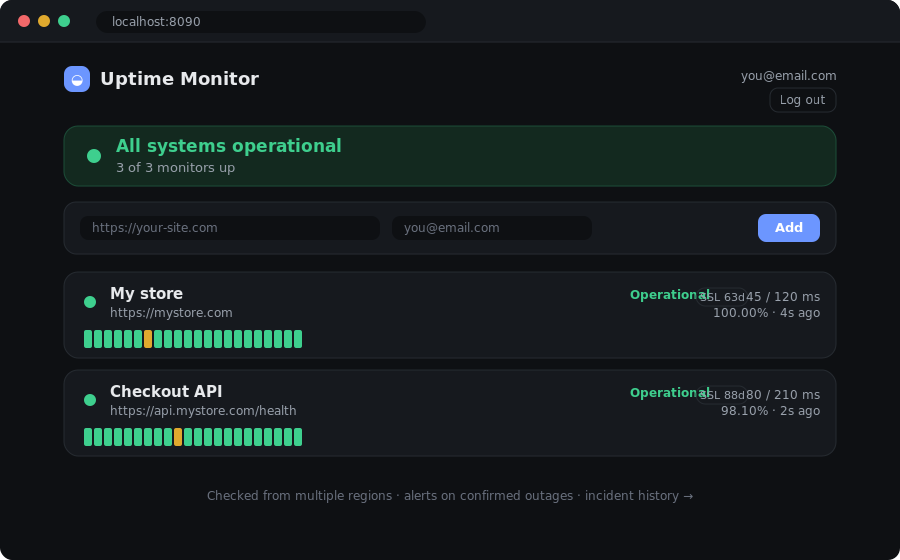
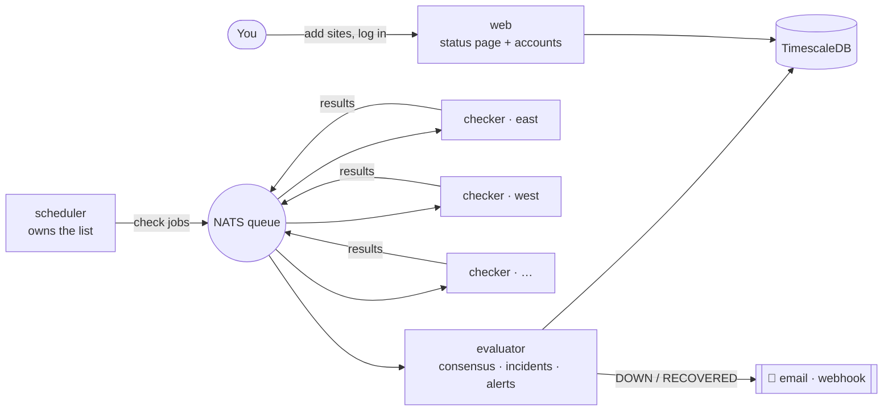

<h1 align="center">Uptime Monitor</h1>

<p align="center">
  <em>Watches your websites so you don't have to — and the moment one goes down, it tells you.</em>
</p>

<p align="center">
  
  
  
  
  
  
  
</p>

<p align="center">
  <strong>Live in production on Google Cloud — monitoring real sites 24/7, with verified email alerting.</strong>
</p>

<p align="center">
  
</p>

---

Ever refreshed your own site at 2 a.m. wondering if it's still alive? I got tired
of *being the monitoring system* — so I built one.

**Uptime Monitor** is a self-hosted service that pings your websites and APIs on a
schedule, from multiple regions, and emails you the instant one actually goes
down — then again when it recovers. It's the kind of tool companies pay for
(Pingdom, UptimeRobot, Better Uptime)… built from scratch, in Go, to learn how
real distributed systems are put together.

I started with a 40-line script and grew it, one hard concept at a time, into a
multi-user product with accounts, a live status page, and infrastructure-as-code —
then **deployed it to Google Cloud, where it runs 24/7 and emails real alerts.**
This repo is that whole journey, in 30 small, readable commits: from a single
process to a fault-tolerant, containerized, production distributed system.

## What it does

- 🔔 **Tells you when your site breaks** — a clean email on `DOWN`, another on `RECOVERED`, with exactly how long it was out.
- 🗳️ **Doesn't cry wolf** — checks from several regions and only alarms when a *majority agree* the site is down, and only after it *stays* down (flap suppression). One bad network path won't wake you at 3 a.m.
- 🌍 **Add any site from the web page** — type a URL, hit add, and it's watched within seconds. No config files.
- 👤 **Multi-user** — secure sign-up/login (bcrypt + sessions), email-based password reset, and strict per-user data isolation; each site alerts *its* owner.
- 📊 **A real status page** — live up/down, 90-day uptime history bars, and p50/p95 response times.
- 🔒 **Catches sneaky failures** — warns before an SSL certificate expires, alerts when a site is merely *slow*, and can require a page to contain expected text ("200 OK but the page is broken").
- 🛠️ **Maintenance mode** — mute a monitor during planned downtime so it doesn't page you.

## Architecture

The interesting part: it isn't one program. A **scheduler** decides *what* to
check and drops jobs on a **NATS** queue; a pool of **checkers** (one per region)
pull those jobs and do the actual pinging; and a single **evaluator** collects the
results, runs the consensus + flap logic, stores everything, and fires alerts. A
separate **web** service serves the status page and accounts. You can run as many
checkers as you like, and killing one doesn't stop monitoring.



Every service is a ~20 MB container built from one multi-stage Dockerfile, and the
whole system comes up with a single `docker compose up`.

## Tech stack

| Concern | Choice | Why |
|---|---|---|
| Language | **Go** | Goroutines map perfectly onto "run many checks at once" |
| Time-series + relational DB | **TimescaleDB** (Postgres) | One engine for both config and the flood of check results |
| Message queue | **NATS** | Decouples scheduling from checking; load-balances via queue groups |
| Migrations | **goose** (embedded) | Plain SQL, applied automatically on boot |
| Auth | **bcrypt + session cookies** | Real accounts, no passwords stored in the clear |
| Containers | **Docker Compose** | The whole stack, one command |
| Infra-as-code | **Terraform** | Multi-region deploy to the cloud, defined in code |
| Observability | **Prometheus + Grafana** | Metrics and dashboards for the monitor itself |
| CI | **GitHub Actions** | `gofmt`, `go vet`, race tests, and image builds on every push |

## Quickstart (just try it)

Only needs **Docker**:

```bash
git clone https://github.com/saimuu1/uptime-monitor
cd uptime-monitor
docker compose -f deploy/docker-compose.yml up --build
```

Open **http://localhost:8090**, sign up, and add your sites. That one command
builds and runs the entire system. To get email alerts, copy `deploy/.env.example`
to `deploy/.env` and fill in a Gmail app password. Optional dashboards:
`--profile observability` (Grafana on :3000).

Deploying it 24/7 to the cloud is a one-command Terraform apply or a single VM —
see [`deploy/`](deploy/).

## How the clever bit works: consensus + flap suppression

The heart of the project is a small, **pure** state machine
([`internal/evaluate`](internal/evaluate/evaluate.go)) — time is passed in, so it's
unit-tested without a clock, a network, or a database:

- Each region's latest result is a **vote**. A monitor is "down" only when a
  *strict majority* of fresh regions agree; ties stay up. A region whose checker
  died stops voting once its sample goes stale — so it can never cause a false alarm.
- A new state must **hold for a stability window** before it's committed, so a
  one-second blip never opens an incident.

That single design decision — treating the decision logic as a pure function — is
why the trickiest behavior in the whole system is also the easiest to test.

## What I learned building it

- **Distributed-systems patterns for real:** a work queue with load-balancing and
  failover, splitting a monolith into services, and why "check from many places and
  vote" beats "check once and panic."
- **Designing for testability:** pushing the hard logic into pure functions
  (consensus, flap suppression, state transitions) so it's provable in milliseconds.
- **The full stack:** from goroutines and SQL up through auth, sessions, and a
  self-serve web UI — plus the ops side: Docker, CI, Terraform, and Prometheus.
- **Multi-tenancy:** the surprisingly deep changes needed to go from "one shared
  page" to "every user owns their own data."
- **Shipping to production:** provisioning a cloud VM, opening firewalls, taming
  a memory-constrained build with swap, and running the redeploy loop
  (`git pull` → rebuild) — the difference between "works on my machine" and *live*.

## Project layout

| Path | Role |
|---|---|
| `cmd/scheduler` | owns the monitor list, publishes check jobs |
| `cmd/checker` | stateless worker, one per region |
| `cmd/evaluator` | consensus, incidents, alerts (the brain) |
| `cmd/web` | status page + accounts |
| `cmd/migrate` | applies embedded DB migrations |
| `cmd/monitor` | the original v1 all-in-one binary |
| `internal/evaluate` | pure consensus + flap-suppression engine (well-tested) |
| `internal/check` · `alert` · `store` · `metrics` | checking, notifications, DB, Prometheus |
| `deploy/` | Docker, Terraform, and cloud deploy guides |
| `migrations/` | goose SQL |

## The journey

Built as four milestones, each adding one hard concept, then extended into a real
product and **shipped**:

- **v1 → v4:** single process → queue-based workers over NATS → multi-region
  consensus + status page → containers, CI, Terraform, and Prometheus/Grafana.
- **Product:** a self-serve web UI, multi-user accounts with password reset, and
  email + webhook alerting.
- **Pro features:** 90-day uptime history, SSL-expiry warnings, an incident log,
  keyword checks, p50/p95 latency, slow-response alerts, and maintenance muting.
- **Deployed:** running live on a Google Cloud VM, watching real sites 24/7, with
  email alerts verified end-to-end. Ships as one `docker compose up`; see
  [`deploy/`](deploy/) for the cloud guides and Terraform.

Possible next steps: a custom domain with HTTPS, request rate-limiting, and
GitHub-Actions auto-deploy on push.

## License

MIT — see [LICENSE](LICENSE).
